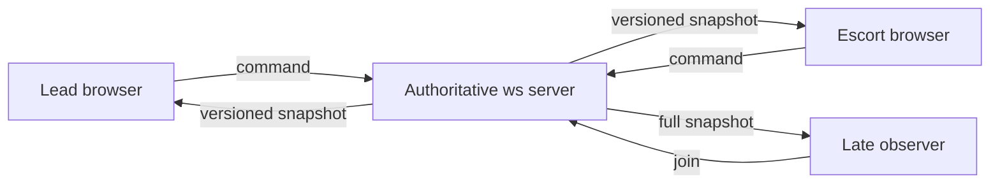

# Architecture

## System boundary

The server is the only owner of `RoomState`. Browser clients own connection state, pending commands, render state, and local transport settings. They never send position, cargo, credits, objective progress, server tick, or snapshot sequence.

## Layers

| Layer | File | Responsibility |
| --- | --- | --- |
| Protocol | `src/protocol.ts` | Parse and bound untrusted commands |
| Simulation | `src/simulation.ts` | Immutable authoritative transitions and state hash |
| Session server | `src/server.ts` | Rooms, role leases, command validation, snapshot broadcast |
| Fault transport | `src/transport.ts` | Seeded delay, drop, duplicate, pair reorder, counters |
| Browser client | `src/client.ts` | Pending ledger, reconnect, reconciliation, metrics |
| Render | `src/game.ts` | Phaser view of server-confirmed state |
| HUD | `src/hud.ts` | Role commands, connection controls, sync receipt |

`protocol.ts`, `simulation.ts`, and `transport.ts` have no Phaser dependency and run under Vitest in Node.

## Authority invariants

1. A client submits a tagged command, never a state replacement.
2. The active socket must match its private session token entry.
3. The requested role must match the assigned role.
4. A `commandId` is applied at most once per room.
5. A role sequence must increase within one lease.
6. Every accepted command or public presence change increments `serverTick` and `snapshotSequence`.
7. A receipt hash covers gameplay state, public presence, command ledger, and sequence cursors.

## Public and private state

`RoomState.connectedRoles` contains booleans only. Reconnect tokens live in the server-only token table and are delivered only in that client's `welcome` message. This prevents an Observer from reading another role's bearer credential from a snapshot.

A disconnected role keeps a 30-second reconnect lease. Reusing the token restores the role and sequence. When a lease expires, a new player may claim the role and its sequence cursor is reset as part of a versioned state change.

## Render boundary

Phaser receives only accepted snapshots. It draws the convoy route, role ships, cargo, hull, and objective marker. The DOM HUD owns controls and text metrics, which keeps gameplay rules out of the render layer and keeps browser tests stable through `data-testid` hooks.
